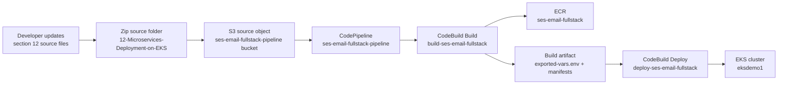
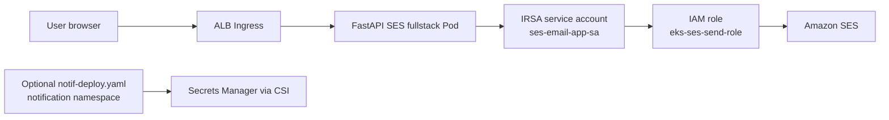
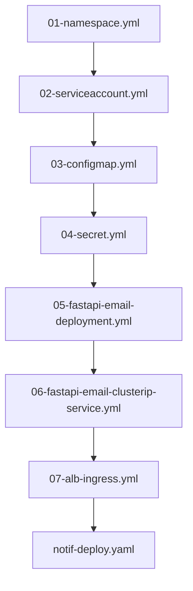
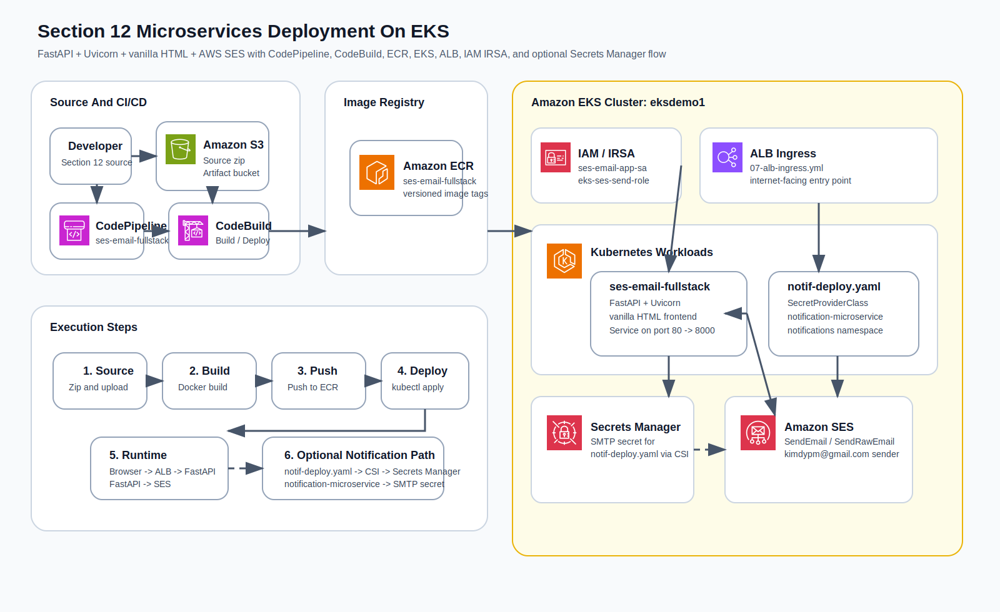

# Section 12 Pipeline And Resource Flow

이 문서는 `/home/AWS-EKS-Class-Master/12-Microservices-Deployment-on-EKS` 폴더에서 구성한 FastAPI + Uvicorn + vanilla HTML + AWS SES 애플리케이션의 절차, 파이프라인, AWS 리소스 사용 흐름을 정리합니다.

## Build And Deploy Flow

## Runtime Resource Flow

## Resource Notes

- `CodePipeline`: `ses-email-fullstack-pipeline`
- `CodeBuild build project`: `build-ses-email-fullstack`
- `CodeBuild deploy project`: `deploy-ses-email-fullstack`
- `ECR repository`: `086015456585.dkr.ecr.ap-northeast-2.amazonaws.com/ses-email-fullstack`
- `EKS cluster`: `eksdemo1`
- `IRSA role`: `arn:aws:iam::086015456585:role/eks-ses-send-role`
- `kubectl assume role`: `arn:aws:iam::086015456585:role/EksCodeBuildKubectlRole`
- `S3 artifact bucket`: `ses-email-fullstack-pipeline-086015456585-ap-northeast-2`

## Manifest Execution Order

## Architecture Diagram

## Icon Source

- AWS Architecture Icons package downloaded from the official AWS architecture icons page:
  `https://aws.amazon.com/architecture/icons/`
