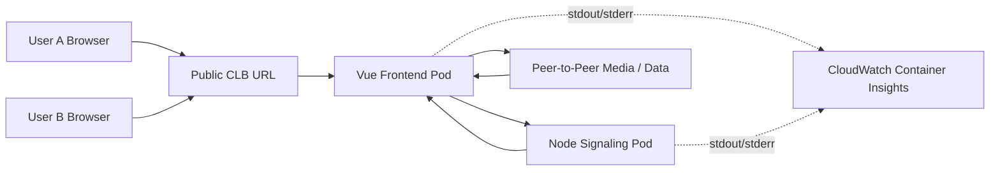
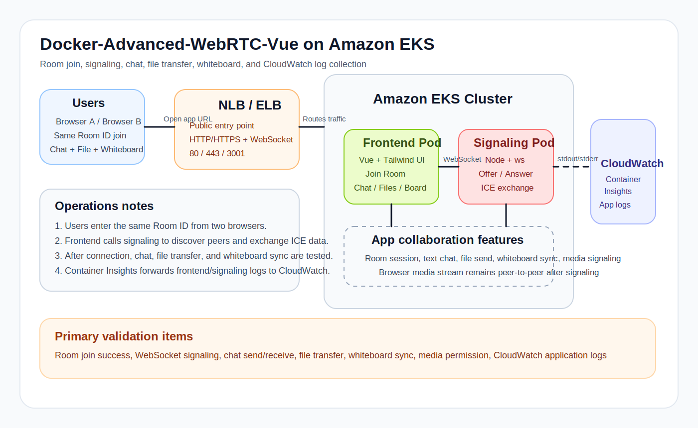

# 19. Docker-Advanced-WebRTC-Vue App on EKS

이 장은 인프라 옵션 자체보다 [`edumgt/Docker-Advanced-WebRTC-Vue`](https://github.com/edumgt/Docker-Advanced-WebRTC-Vue) 앱이 제공하는 기능을 EKS에서 어떻게 공개하고 체험하는지에 초점을 맞춘 실습입니다.

앱 핵심 기능:
- Room ID 기반 입장
- WebSocket signaling
- 실시간 채팅
- 파일 전송
- 화이트보드 공유
- 브라우저 카메라/마이크/화면공유

EKS 구성:
- `frontend` 컨테이너: Vue + Tailwind WebRTC UI
- `signaling` 컨테이너: Node WebSocket signaling 서버
- `Service type=LoadBalancer`: CLB 외부 접속점

## Node.js 서버 없이 가능한가?

현재 `Docker-Advanced-WebRTC-Vue` 코드는 **Node.js signaling 서버 없이 동작하지 않습니다.**

이유:
- 브라우저끼리 직접 미디어를 주고받는 것은 WebRTC가 처리하지만
- 연결 직전에 필요한 `offer / answer / ICE candidate` 교환은 별도 signaling 채널이 필요합니다
- 현재 소스는 [`useWebRTC.js`](/tmp/Docker-Advanced-WebRTC-Vue/src/composables/useWebRTC.js) 에서 `new WebSocket(getSignalUrl())` 로 signaling 서버를 전제합니다

즉 지금 앱 기준으로는:
- `frontend` 만 배포: 불가
- `frontend + signaling` 함께 배포: 가능

정말 Node.js 서버를 없애려면 앱 구조를 바꿔서 아래 중 하나로 대체해야 합니다.
- API Gateway WebSocket
- AppSync / PubSub 계열 signaling
- 별도 signaling SaaS 또는 다른 signaling 구현체

이 장은 그래서 옵션별 예제를 모두 걷어내고, **WebRTC 실습에 필요한 EKS YAML만** 남겼습니다.

CLB 기준 구성:
- `Service type=LoadBalancer` 만 사용
- NLB 전용 annotation 제거
- legacy EKS service controller 기준으로 Classic Load Balancer 생성을 기대

예시 이미지:
- `086015456585.dkr.ecr.ap-northeast-2.amazonaws.com/webrtc-vue-frontend:latest`
- `086015456585.dkr.ecr.ap-northeast-2.amazonaws.com/webrtc-vue-signaling:latest`

## 업무 Flowchart



## 구성 아키텍처



## 남겨둔 EKS YAML

하나의 `kube-manifests` 폴더에 순차 적용용 YAML만 남겼습니다.

- [01-namespace.yml](/home/AWS-EKS-Class-Master/19-EKS-Docker-Advanced-WebRTC-Vue/kube-manifests/01-namespace.yml)
- [02-webrtc-deployment.yml](/home/AWS-EKS-Class-Master/19-EKS-Docker-Advanced-WebRTC-Vue/kube-manifests/02-webrtc-deployment.yml)
- [03-webrtc-loadbalancer-service.yml](/home/AWS-EKS-Class-Master/19-EKS-Docker-Advanced-WebRTC-Vue/kube-manifests/03-webrtc-loadbalancer-service.yml)
  CLB 생성용 Service

배포:

```bash
kubectl apply -f /home/AWS-EKS-Class-Master/19-EKS-Docker-Advanced-WebRTC-Vue/kube-manifests/01-namespace.yml
kubectl apply -f /home/AWS-EKS-Class-Master/19-EKS-Docker-Advanced-WebRTC-Vue/kube-manifests/02-webrtc-deployment.yml
kubectl apply -f /home/AWS-EKS-Class-Master/19-EKS-Docker-Advanced-WebRTC-Vue/kube-manifests/03-webrtc-loadbalancer-service.yml
kubectl get pods -n webrtc
kubectl get svc -n webrtc
```

접속:

```bash
kubectl get svc webrtc-vue-service -n webrtc \
  -o jsonpath='{.status.loadBalancer.ingress[0].hostname}'
```

- frontend: `http://<ELB-HOSTNAME>`
- signaling: `ws://<ELB-HOSTNAME>:3001`

참고:
- 이 매니페스트는 CLB 기준으로 최대한 단순화했습니다.
- 다만 클러스터에 `AWS Load Balancer Controller` 또는 EKS Auto Mode가 개입하면 실제 생성 타입은 달라질 수 있습니다.

테스트 포인트:
1. 브라우저 2개를 열고 같은 Room ID 입력
2. Join Room 실행
3. 채팅 송수신 확인
4. 파일 전송 확인
5. 화이트보드 동기화 확인

## CloudWatch 로그 수집

19장의 WebRTC 앱 로그는 각 컨테이너의 `stdout/stderr` 로 남기면 CloudWatch Container Insights가 그대로 수집합니다.

사전 조건:
- EKS worker node IAM role에 `CloudWatchAgentServerPolicy` 연결
- 클러스터에 Container Insights 설치

설치:

```bash
cd /home/AWS-EKS-Class-Master/19-EKS-Docker-Advanced-WebRTC-Vue
chmod +x scripts/*.sh
./scripts/install-cloudwatch-container-insights.sh <CLUSTER_NAME> ap-northeast-2
kubectl get daemonsets -n amazon-cloudwatch
```

로그가 쌓이는 위치:
- 로그 그룹: `/aws/containerinsights/<CLUSTER_NAME>/application`
- 주요 컨테이너:
  - `frontend`
  - `signaling`

Log Insights 예시:

```text
fields @timestamp, kubernetes.namespace_name, kubernetes.pod_name, kubernetes.container_name, log
| filter kubernetes.container_name in ["frontend","signaling"]
| sort @timestamp desc
| limit 100
```

Fargate 실습은 namespace 기준 필터도 유용합니다.

```text
fields @timestamp, kubernetes.namespace_name, kubernetes.pod_name, kubernetes.container_name, log
| filter kubernetes.namespace_name = "webrtc"
| sort @timestamp desc
| limit 100
```
