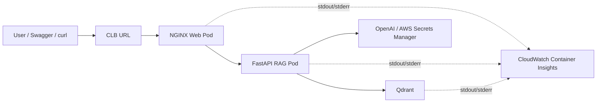
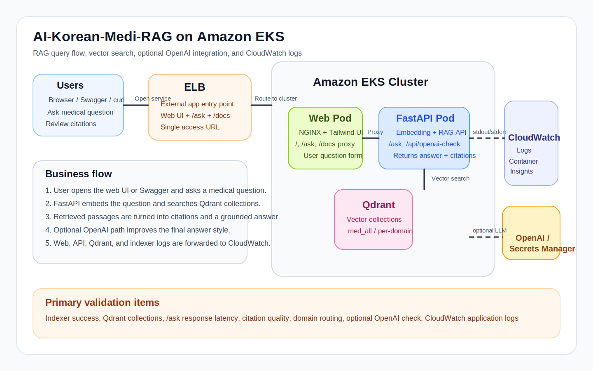

# 20. AI-Korean-Medi-RAG App on EKS

이 장은 기존 주제를 완전히 걷어내고, [`edumgt/AI-Korean-Medi-RAG`](https://github.com/edumgt/AI-Korean-Medi-RAG) 애플리케이션 자체의 기능을 EKS에서 서비스하는 흐름으로 재편한 실습입니다.

앱 핵심 기능:
- 의료 문서 벡터 인덱싱
- 근거 포함 RAG 질의
- 도메인별 컬렉션 검색
- OpenAI 또는 AWS Secrets Manager 기반 LLM 연동
- Web UI와 Swagger를 통한 즉시 테스트

앱 구성:
- `Qdrant`
  벡터 검색 엔진
- `FastAPI`
  `/ask`, `/api/openai-check`, `/docs`
- `NGINX Web`
  사용자가 직접 질의하는 화면

## 업무 Flowchart



## 구성 아키텍처



아키텍처:

```text
Browser
  |
CLB (med-rag-web-service)
  |
NGINX Web
  |
FastAPI RAG API
  |
Qdrant
```

## Step-01: 소스 동기화

```bash
git clone https://github.com/edumgt/AI-Korean-Medi-RAG /tmp/AI-Korean-Medi-RAG
cd /home/AWS-EKS-Class-Master/20-EKS-AI-Korean-Medi-RAG
chmod +x scripts/*.sh
./scripts/sync-source.sh /tmp/AI-Korean-Medi-RAG
```

## Step-02: API 이미지 빌드

```bash
./scripts/build-and-push.sh
```

## Step-03: 앱 배포

```bash
kubectl apply -f kube-manifests/01-namespace.yaml
kubectl apply -f kube-manifests/02-storage-class.yaml
kubectl apply -f kube-manifests/03-llm-secret.yaml
kubectl apply -f kube-manifests/04-qdrant-statefulset.yaml
kubectl apply -f kube-manifests/05-qdrant-service.yaml
kubectl apply -f kube-manifests/06-api-configmap.yaml
kubectl apply -f kube-manifests/07-api-deployment.yaml
kubectl apply -f kube-manifests/08-api-service.yaml
kubectl apply -f kube-manifests/09-web-configmap.yaml
kubectl apply -f kube-manifests/10-web-deployment.yaml
kubectl apply -f kube-manifests/11-web-service.yaml
```

현재 [11-web-service.yaml](/home/AWS-EKS-Class-Master/20-EKS-AI-Korean-Medi-RAG/kube-manifests/11-web-service.yaml) 은 별도 NLB annotation 없이 `type: LoadBalancer` 만 사용하므로 CLB 실습형입니다.

## Step-04: 샘플 데이터 적재

이 앱은 문서가 적재되어야 실제 기능이 보입니다.

```bash
kubectl apply -f kube-manifests/12-indexer-job.yaml
kubectl logs -f job/med-rag-indexer -n med-rag
```

## Step-05: 사용자 접속

```bash
kubectl get svc med-rag-web-service -n med-rag \
  -o jsonpath='{.status.loadBalancer.ingress[0].hostname}'
```

접속 포인트:
- `/`
  Tailwind 기반 질의 화면
- `/docs`
  Swagger UI
- `/ask`
  RAG 질의 API
- `/api/openai-check`
  OpenAI 연결 확인

## Step-06: 기능 테스트

### 근거 기반 질의

```bash
curl -X POST http://<ELB-HOSTNAME>/ask \
  -H "Content-Type: application/json" \
  -d '{"query":"CAH 조기진단에 가장 중요한 호르몬 수치는 무엇인가요?","domain":"소아청소년과","top_k":4}'
```

확인 포인트:
- `answer`
- `citations`
- `used_collection`

### 도메인별 검색

`domain` 값을 지정하면 해당 과목 컬렉션을 우선 조회하고, 비우면 전체 컬렉션 `med_all`을 조회합니다.

### OpenAI 연동

기본은 `LLM_PROVIDER=none` 이라 근거 기반 요약 중심입니다.  
생성형 답변을 쓰려면 아래 두 파일을 조정합니다.

- [03-llm-secret.yaml](/home/AWS-EKS-Class-Master/20-EKS-AI-Korean-Medi-RAG/kube-manifests/03-llm-secret.yaml)
- [06-api-configmap.yaml](/home/AWS-EKS-Class-Master/20-EKS-AI-Korean-Medi-RAG/kube-manifests/06-api-configmap.yaml)

## Step-07: 현재 장의 핵심 YAML

- [04-qdrant-statefulset.yaml](/home/AWS-EKS-Class-Master/20-EKS-AI-Korean-Medi-RAG/kube-manifests/04-qdrant-statefulset.yaml)
  Qdrant 저장소
- [07-api-deployment.yaml](/home/AWS-EKS-Class-Master/20-EKS-AI-Korean-Medi-RAG/kube-manifests/07-api-deployment.yaml)
  FastAPI RAG 앱
- [09-web-configmap.yaml](/home/AWS-EKS-Class-Master/20-EKS-AI-Korean-Medi-RAG/kube-manifests/09-web-configmap.yaml)
  Web UI와 API 프록시
- [11-web-service.yaml](/home/AWS-EKS-Class-Master/20-EKS-AI-Korean-Medi-RAG/kube-manifests/11-web-service.yaml)
  CLB 생성용 외부 사용자 접속점
- [12-indexer-job.yaml](/home/AWS-EKS-Class-Master/20-EKS-AI-Korean-Medi-RAG/kube-manifests/12-indexer-job.yaml)
  샘플 문서 적재

## Step-08: 정리

```bash
kubectl delete namespace med-rag
```

## Step-09: CloudWatch 로그 수집

20장의 Medi-RAG 앱 로그도 CloudWatch Container Insights로 함께 수집할 수 있습니다. 별도 애플리케이션 수정 없이 컨테이너 로그가 `stdout/stderr` 로 출력되면 됩니다.

사전 조건:
- EKS worker node IAM role에 `CloudWatchAgentServerPolicy` 연결
- 클러스터에 Container Insights 설치

설치:

```bash
cd /home/AWS-EKS-Class-Master/20-EKS-AI-Korean-Medi-RAG
chmod +x scripts/*.sh
./scripts/install-cloudwatch-container-insights.sh <CLUSTER_NAME> ap-northeast-2
kubectl get daemonsets -n amazon-cloudwatch
```

로그 그룹:
- `/aws/containerinsights/<CLUSTER_NAME>/application`

주요 로그 대상:
- `med-rag-api`
- `med-rag-web`
- `qdrant`
- `med-rag-indexer`

Log Insights 예시:

```text
fields @timestamp, kubernetes.namespace_name, kubernetes.pod_name, kubernetes.container_name, log
| filter kubernetes.namespace_name = "med-rag"
| sort @timestamp desc
| limit 100
```

API 컨테이너만 보려면:

```text
fields @timestamp, kubernetes.pod_name, kubernetes.container_name, log
| filter kubernetes.namespace_name = "med-rag"
| filter kubernetes.container_name = "api"
| sort @timestamp desc
| limit 100
```

삭제:

```bash
./scripts/delete-cloudwatch-container-insights.sh <CLUSTER_NAME> ap-northeast-2
```

참고:
- 20장도 CLB 기준으로 단순 `LoadBalancer` Service를 사용합니다.
- 다만 실제 클러스터 설정에 따라 NLB가 생성될 수 있으니, 배포 후 `kubectl get svc` 와 AWS 콘솔에서 실제 타입을 확인하는 것이 안전합니다.
