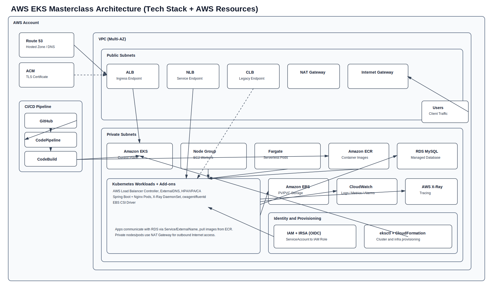

# AWS EKS Masterclass - Architecture Overview

이 문서는 이 저장소에서 사용하는 기술 스택과 AWS 리소스를 한눈에 보는 아키텍처 요약입니다.

## 다이어그램 파일
- 최신 편집본(권장): `ARCHITECTURE.drawio`
- Preview image (`svg`): `ARCHITECTURE.svg`



## 기술 스택
- Kubernetes: EKS, Deployment/Service/Ingress, HPA/VPA/Cluster Autoscaler
- Containers: Docker, Nginx, Amazon ECR
- Application: Java 8, Spring Boot (Web/JPA), Maven
- IaC/Provisioning: eksctl, CloudFormation
- Networking: ALB/NLB/CLB, ExternalDNS, Route 53, ACM
- Data/Storage: Amazon RDS MySQL, Amazon EBS (EBS CSI Driver)
- Observability: AWS X-Ray, CloudWatch Container Insights (cwagent + Fluentd)
- CI/CD: GitHub, CodeBuild, CodePipeline, STS AssumeRole

## AWS 리소스 아키텍처
```mermaid
flowchart LR
  U[User / Client]

  subgraph AWS[AWS Account]
    subgraph EDGE[DNS and Certificate]
      R53[Route 53 Hosted Zone]
      ACM[ACM Certificate]
    end

    IGW[Internet Gateway]

    subgraph VPC[VPC (Multi-AZ)]
      direction LR

      subgraph PUB[Public Subnets]
        ALB[ALB (Ingress)]
        NLB[NLB (Service)]
        CLB[CLB (Legacy Service)]
        NAT[NAT Gateway]
      end

      subgraph PRI[Private Subnets]
        EKS[EKS Control Plane]
        NG[Managed Node Group (EC2)]
        FGT[Fargate Profiles]

        subgraph K8S[Kubernetes Add-ons and Workloads]
          LBC[AWS Load Balancer Controller]
          EXDNS[ExternalDNS]
          APPS[Spring Boot + Nginx Pods]
          EBSCSI[EBS CSI Driver]
          XRDS[X-Ray DaemonSet]
          CWDS[CloudWatch Agent + Fluentd]
          ASCALE[HPA / VPA / Cluster Autoscaler]
        end

        EBS[Amazon EBS Volumes]
        RDS[Amazon RDS MySQL]
        ECR[Amazon ECR]
        XRY[AWS X-Ray]
        CW[CloudWatch Container Insights]
      end
    end

    subgraph CICD[DevOps Pipeline]
      GH[GitHub]
      CP[CodePipeline]
      CBB[CodeBuild - Build]
      CBD[CodeBuild - Deploy]
      STS[STS AssumeRole]
    end

    IAM[IAM + IRSA (OIDC)]
    CFN[eksctl + CloudFormation]
  end

  U --> R53 --> ALB
  ACM -. TLS .-> ALB
  U --> NLB
  U -. legacy .-> CLB

  ALB --> LBC
  NLB --> APPS
  CLB --> APPS
  LBC --> APPS
  EXDNS --> R53

  EKS --> NG
  EKS --> FGT
  EKS --> APPS
  ASCALE --> APPS

  APPS --> RDS
  EBSCSI --> EBS
  APPS -. image pull .-> ECR

  XRDS --> XRY
  CWDS --> CW
  APPS --> CW

  NG --> NAT --> IGW
  FGT --> NAT

  GH --> CP --> CBB --> ECR
  CBB --> CBD --> STS --> EKS
  CBD --> APPS

  CFN --> VPC
  CFN --> EKS
  CFN --> IAM

  IAM --> LBC
  IAM --> EXDNS
  IAM --> XRDS
  IAM --> CWDS
```

## 참고
- 일부 실습에서는 선택적으로 `Secrets Manager/SSM + KMS + Secrets Store CSI Driver`, `SES SMTP`를 함께 사용합니다.
