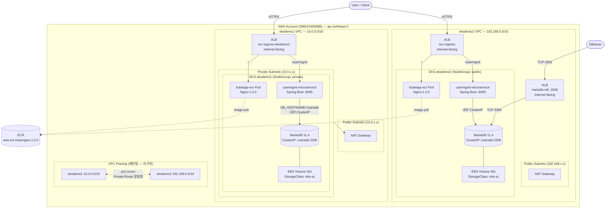

# AWS EKS Lab — Architecture

> `ARCHITECTURE.drawio` / `ARCHITECTURE.svg` 는 이 문서로 통합되었습니다.
> 현재 실제 배포 상태를 기준으로 작성된 단일 아키텍처 문서입니다.

---

## 1. 전체 구성 개요

| 구분 | eksdemo1 | eksdemo2 |
|---|---|---|
| **VPC CIDR** | `10.0.0.0/16` (신규) | `192.168.0.0/16` |
| **VPC ID** | vpc-0d929a3c7be826c6a | vpc-0a31321ddfd455d8d |
| **K8s 버전** | 1.34 | 1.34 |
| **노드그룹** | eksdemo1-ng-private1 (private, NAT) | eksdemo2 + ng-7f75f (public) |
| **인스턴스** | t3.medium × 2 | t3.medium × 3 |
| **ALB** | ecr-ingress-eksdemo1 | ecr-ingress |
| **DB** | MariaDB 11.4 on EBS (내부) | MariaDB 11.4 on EBS (내부) |
| **외부 DB 접속** | — | mariadb-nlb (NLB, internet-facing :3306) |

---

## 2. 아키텍처 다이어그램


```mermaid
flowchart TB
  User([User / Client])
  DBeaver([DBeaver])
  ECR[(ECR\naws-ecr-kubenginx:1.0.0)]

  subgraph AWS["AWS Account (086015456585) — ap-northeast-2"]

    subgraph VPC1["eksdemo1 VPC — 10.0.0.0/16"]
      direction TB
      ALB1[ALB\necr-ingress-eksdemo1\ninternet-facing]

      subgraph PUB1["Public Subnets (10.0.x.x)"]
        NAT1[NAT Gateway]
      end

      subgraph PRI1["Private Subnets (10.0.x.x)"]
        subgraph EKS1["EKS eksdemo1 (NodeGroup: private)"]
          nginx1[kubeapp-ecr Pod\nNginx:1.0.0]
          be1[usermgmt-microservice\nSpring Boot :8095]
          db1[(MariaDB 11.4\nClusterIP: mariadb:3306)]
          ebs1[EBS Volume 4Gi\nStorageClass: ebs-sc]
          db1 --- ebs1
        end
      end

      ALB1 -->|"/"| nginx1
      ALB1 -->|"/usermgmt"| be1
      be1 -->|"DB_HOSTNAME=mariadb\n내부 ClusterIP"| db1
      PRI1 --> NAT1
    end

    subgraph VPC2["eksdemo2 VPC — 192.168.0.0/16"]
      direction TB
      ALB2[ALB\necr-ingress\ninternet-facing]
      NLB2[NLB\nmariadb-nlb :3306\ninternet-facing]

      subgraph PUB2["Public Subnets (192.168.x.x)"]
        NAT2[NAT Gateway]
      end

      subgraph EKS2["EKS eksdemo2 (NodeGroup: public)"]
        nginx2[kubeapp-ecr Pod\nNginx:1.0.0]
        be2[usermgmt-microservice\nSpring Boot :8095]
        db2[(MariaDB 11.4\nClusterIP: mariadb:3306)]
        ebs2[EBS Volume 4Gi\nStorageClass: ebs-sc]
        db2 --- ebs2
      end

      ALB2 -->|"/"| nginx2
      ALB2 -->|"/usermgmt"| be2
      be2 -->|"내부 ClusterIP"| db2
      NLB2 -->|TCP 3306| db2
    end

    subgraph PEERING["VPC Peering (제안됨 — 미구현)"]
      direction LR
      P1["eksdemo1 10.0.0.0/16"] <-.->|"pcx-xxxxx\nPrivate Route 양방향"| P2["eksdemo2 192.168.0.0/16"]
    end
  end

  User -->|HTTPS| ALB1
  User -->|HTTPS| ALB2
  DBeaver -->|TCP 3306| NLB2
  nginx1 -.->|image pull| ECR
  nginx2 -.->|image pull| ECR
```

---

## 3. 네트워크 구성

### eksdemo1 (10.0.0.0/16)
| 서브넷 | AZ | 유형 |
|---|---|---|
| 10.0.0.0/19 | ap-northeast-2a | Private |
| 10.0.32.0/19 | ap-northeast-2b | Private |
| 10.0.64.0/19 | ap-northeast-2a | Public |
| 10.0.96.0/19 | ap-northeast-2b | Public |

### eksdemo2 (192.168.0.0/16)
| 서브넷 | AZ | 유형 |
|---|---|---|
| 192.168.0.0/19 | ap-northeast-2a | Public |
| 192.168.32.0/19 | ap-northeast-2b | Public |
| 192.168.64.0/19 | ap-northeast-2a | Private |
| 192.168.96.0/19 | ap-northeast-2b | Private |

---

## 4. Kubernetes 워크로드 상세

### 공통 (eksdemo1 / eksdemo2 동일 구성)

| 리소스 | 이름 | 상세 |
|---|---|---|
| Deployment | `kubeapp-ecr` | ECR Nginx 이미지 (2 replicas) |
| Deployment | `mariadb` | MariaDB 11.4 (1 replica, Recreate) |
| Deployment | `usermgmt-microservice` | Spring Boot UserMgmt API |
| Service | `mariadb` | ClusterIP None (Headless) :3306 |
| Service | `kubeapp-ecr-nodeport-service` | NodePort :80 |
| Service | `usermgmt-restapp-service` | NodePort :8095 (nodePort 31231) |
| Ingress | `ecr-ingress-service` | ALB, ingressClassName: alb |
| PVC | `ebs-mariadb-pv-claim` | 4Gi, StorageClass: ebs-sc |
| ConfigMap | `usermanagement-dbcreation-script` | usermgmt DB 초기화 SQL |
| StorageClass | `ebs-sc` | ebs.csi.aws.com, WaitForFirstConsumer |

### eksdemo2 추가
| 리소스 | 이름 | 상세 |
|---|---|---|
| Service | `mariadb-nlb` | LoadBalancer (NLB, internet-facing) :3306 |

---

## 5. IAM / Add-on 구성

| 구성 요소 | eksdemo1 | eksdemo2 |
|---|---|---|
| OIDC Provider | ✅ | ✅ |
| EBS CSI Driver | ✅ (v1.55.0) | ✅ (v1.55.0) |
| AmazonEBSCSIDriverPolicy | NodeInstanceRole 연결 | NodeInstanceRole 연결 (2개) |
| AWS Load Balancer Controller | ✅ Helm + IRSA | ✅ Helm + IRSA |
| AWSLoadBalancerControllerIAMPolicy | IRSA 연결 | IRSA 연결 |
| ECR Pull 권한 | AmazonEC2ContainerRegistryPullOnly | AmazonEC2ContainerRegistryPullOnly + PowerUser |

---

## 6. ECR 리포지토리

| 항목 | 값 |
|---|---|
| URI | `086015456585.dkr.ecr.ap-northeast-2.amazonaws.com/aws-ecr-kubenginx` |
| 태그 | `1.0.0` |
| Tag Immutability | Enabled |
| Scan on Push | Enabled |

---

## 7. 접속 엔드포인트

| 용도 | URL |
|---|---|
| eksdemo1 Nginx | `http://ecr-ingress-eksdemo1-932013938.ap-northeast-2.elb.amazonaws.com/` |
| eksdemo1 UserMgmt API | `http://ecr-ingress-eksdemo1-932013938.ap-northeast-2.elb.amazonaws.com/usermgmt/health-status` |
| eksdemo2 Nginx | `http://ecr-ingress-1998677918.ap-northeast-2.elb.amazonaws.com/` |
| eksdemo2 UserMgmt API | `http://ecr-ingress-1998677918.ap-northeast-2.elb.amazonaws.com/usermgmt/health-status` |
| eksdemo2 MariaDB (DBeaver) | `k8s-default-mariadbn-a26d25ec7b-6138443a3b51e70c.elb.ap-northeast-2.amazonaws.com:3306` |

---

## 8. 크로스 VPC 연결 제안 (미구현)

VPC CIDR이 다르므로 VPC Peering을 통한 private 연결이 가능합니다.

```
eksdemo1 BE Pod (10.x.x.x)
  └─ VPC Peering (pcx-xxxxx)
       └─ eksdemo2 Internal NLB (192.168.x.x:3306)
            └─ MariaDB Pod
```

구현 단계:
1. VPC Peering 연결 생성 (eksdemo1 ↔ eksdemo2)
2. 양쪽 Route Table에 상대 CIDR 경로 추가
3. eksdemo2 보안 그룹: TCP 3306 from 10.0.0.0/16 허용
4. eksdemo2에 Internal NLB 생성 (mariadb 대상)
5. eksdemo1 `DB_HOSTNAME` = Internal NLB DNS 주소

---

## 9. 랩 폴더 구성

| 폴더 | 주제 |
|---|---|
| 01-EKS-Create-Cluster-using-eksctl | eksctl로 클러스터 생성 |
| 02-ECR-Elastic-Container-Registry-and-EKS | ECR + EKS 연동 |
| 04-EKS-Storage-with-EBS-ElasticBlockStore | EBS CSI + MariaDB |
| 05-Kubernetes-Important-Concepts | K8s 핵심 개념 |
| 06-EKS-Storage-with-RDS-Database | RDS 연동 |
| 07-ELB-Classic-and-Network-LoadBalancers | CLB / NLB |
| 08-ALB-Application-LoadBalancers | ALB Ingress |
| 09-EKS-Workloads-on-Fargate | Fargate |
| 11-NEW-DevOps-with-Github | GitHub CI/CD |
| 12-Microservices-Deployment-on-EKS | 마이크로서비스 |
| 13-Microservices-Distributed-Tracing-using-AWS-XRay-on-EKS | X-Ray |
| 14-Microservices-Canary-Deployments | 카나리 배포 |
| 15-EKS-HPA-Horizontal-Pod-Autoscaler | HPA |
| 16-EKS-VPA-Vertical-Pod-Autoscaler | VPA |
| 17-EKS-Autoscaling-Cluster-Autoscaler | Cluster Autoscaler |
| 18-EKS-Monitoring-using-Grafana | Grafana 모니터링 |
| 19-EKS-Docker-Advanced-WebRTC-Vue | WebRTC + Vue |
| 20-EKS-AI-Korean-Medi-RAG | AI RAG 서비스 |
