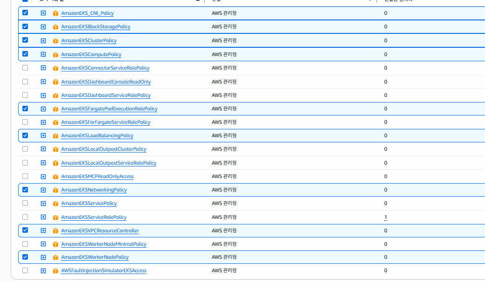

## AWS EKS Class Master



> `stacksimplify` 계열 실습을 바탕으로 현재 워크스페이스 기준으로 재정리한 EKS 교육용 저장소입니다.

이 저장소는 Amazon EKS를 중심으로 클러스터 생성, 스토리지, 로드밸런싱, Fargate, DevOps, 마이크로서비스, 오토스케일링, 모니터링, 그리고 EKS 위에서 실제 앱을 서비스하는 실습까지 단계적으로 다룹니다.

## 현재 폴더 구성

| 번호 | 폴더 | 현재 실습 주제 |
| ---- | ---- | -------------- |
| 01 | [01-EKS-Create-Cluster-using-eksctl](/home/AWS-EKS-Class-Master/01-EKS-Create-Cluster-using-eksctl) | `eksctl`로 EKS 클러스터와 노드그룹 생성 |
| 02 | [02-ECR-Elastic-Container-Registry-and-EKS](/home/AWS-EKS-Class-Master/02-ECR-Elastic-Container-Registry-and-EKS) | Amazon ECR 연동 및 EKS에서 ECR 이미지 사용 |
| 04 | [04-EKS-Storage-with-EBS-ElasticBlockStore](/home/AWS-EKS-Class-Master/04-EKS-Storage-with-EBS-ElasticBlockStore) | EBS CSI Driver와 EKS 영구 스토리지 |
| 05 | [05-Kubernetes-Important-Concepts-for-Application-Deployments](/home/AWS-EKS-Class-Master/05-Kubernetes-Important-Concepts-for-Application-Deployments) | Pod, Deployment, Service, Secret, Init Container, Probe, Resource, Namespace 등 Kubernetes 핵심 개념 |
| 06 | [06-EKS-Storage-with-RDS-Database](/home/AWS-EKS-Class-Master/06-EKS-Storage-with-RDS-Database) | RDS와 연계한 애플리케이션 데이터 접근 |
| 07 | [07-ELB-Classic-and-Network-LoadBalancers](/home/AWS-EKS-Class-Master/07-ELB-Classic-and-Network-LoadBalancers) | CLB / NLB 기반 Service 노출 |
| 08 | [08-ALB-Application-LoadBalancers](/home/AWS-EKS-Class-Master/08-ALB-Application-LoadBalancers) | ALB Ingress, SSL, Redirect, ExternalDNS |
| 09 | [09-EKS-Workloads-on-Fargate](/home/AWS-EKS-Class-Master/09-EKS-Workloads-on-Fargate) | EKS Fargate 프로파일과 서버리스 워크로드 배포 |
| 11 | [11-NEW-DevOps-with-AWS-CdoeSeries](/home/AWS-EKS-Class-Master/11-NEW-DevOps-with-AWS-CdoeSeries) | AWS 개발자 도구 기반 DevOps 파이프라인 |
| 12 | [12-Microservices-Deployment-on-EKS](/home/AWS-EKS-Class-Master/12-Microservices-Deployment-on-EKS) | 마이크로서비스 배포, 서비스 디스커버리, AWS 아이콘 자산 |
| 13 | [13-Microservices-Distributed-Tracing-using-AWS-XRay-on-EKS](/home/AWS-EKS-Class-Master/13-Microservices-Distributed-Tracing-using-AWS-XRay-on-EKS) | AWS X-Ray 기반 분산 추적 |
| 14 | [14-Microservices-Canary-Deployments](/home/AWS-EKS-Class-Master/14-Microservices-Canary-Deployments) | NGINX 기반 stable / canary 배포 실습 |
| 15 | [15-EKS-HPA-Horizontal-Pod-Autoscaler](/home/AWS-EKS-Class-Master/15-EKS-HPA-Horizontal-Pod-Autoscaler) | HPA, Jupyter 세션 매니저, FE/BE/Redis, 사용자별 Notebook 실행 |
| 16 | [16-EKS-VPA-Vertical-Pod-Autoscaler](/home/AWS-EKS-Class-Master/16-EKS-VPA-Vertical-Pod-Autoscaler) | VPA 추천값, Pod 리소스 변경 관찰, 부하 테스트 |
| 17 | [17-EKS-Autoscaling-Cluster-Autoscaler](/home/AWS-EKS-Class-Master/17-EKS-Autoscaling-Cluster-Autoscaler) | Cluster Autoscaler와 노드 자동 확장 |
| 18 | [18-EKS-Monitoring-using-CloudWatch-Container-Insights](/home/AWS-EKS-Class-Master/18-EKS-Monitoring-using-CloudWatch-Container-Insights) | CloudWatch Container Insights, Log Insights, Prometheus, Grafana |
| 19 | [19-EKS-Docker-Advanced-WebRTC-Vue](/home/AWS-EKS-Class-Master/19-EKS-Docker-Advanced-WebRTC-Vue) | Docker-Advanced-WebRTC-Vue 앱을 EKS에서 CLB 기반으로 서비스 |
| 20 | [20-EKS-AI-Korean-Medi-RAG](/home/AWS-EKS-Class-Master/20-EKS-AI-Korean-Medi-RAG) | AI-Korean-Medi-RAG 앱을 EKS에서 CLB 기반으로 서비스 |

## 빠른 진입 링크

| 번호 | 대표 문서 | 핵심 포인트 |
| ---- | -------- | ----------- |
| 01 | [README.md](/home/AWS-EKS-Class-Master/01-EKS-Create-Cluster-using-eksctl/README.md) | `eksctl` 기반 EKS 클러스터 생성 시작점 |
| 02 | [README.md](/home/AWS-EKS-Class-Master/02-ECR-Elastic-Container-Registry-and-EKS/README.md) | ECR 리포지토리와 EKS 이미지 사용 |
| 04 | [README.md](/home/AWS-EKS-Class-Master/04-EKS-Storage-with-EBS-ElasticBlockStore/README.md) | EBS CSI Driver, StorageClass, PVC |
| 05 | [README.md](/home/AWS-EKS-Class-Master/05-Kubernetes-Important-Concepts-for-Application-Deployments/README.md) | Kubernetes 배포 핵심 개념 정리 |
| 06 | [README.md](/home/AWS-EKS-Class-Master/06-EKS-Storage-with-RDS-Database/README.md) | EKS와 RDS 연계 |
| 07 | [README.md](/home/AWS-EKS-Class-Master/07-ELB-Classic-and-Network-LoadBalancers/README.md) | CLB / NLB 서비스 노출 |
| 08 | [README.md](/home/AWS-EKS-Class-Master/08-ALB-Application-LoadBalancers/README.md) | ALB Ingress와 SSL, Redirect, DNS |
| 09 | [README.md](/home/AWS-EKS-Class-Master/09-EKS-Workloads-on-Fargate/README.md) | Fargate 워크로드 배포 |
| 11 | [README.md](/home/AWS-EKS-Class-Master/11-NEW-DevOps-with-AWS-CdoeSeries/README.md) | AWS Code 계열 DevOps 파이프라인 |
| 12 | [README.md](/home/AWS-EKS-Class-Master/12-Microservices-Deployment-on-EKS/README.md) | 마이크로서비스 배포 및 서비스 디스커버리 |
| 13 | [README.md](/home/AWS-EKS-Class-Master/13-Microservices-Distributed-Tracing-using-AWS-XRay-on-EKS/README.md) | X-Ray 분산 추적 |
| 14 | [README.md](/home/AWS-EKS-Class-Master/14-Microservices-Canary-Deployments/README.md) | stable / canary 트래픽 분산 |
| 15 | [README.md](/home/AWS-EKS-Class-Master/15-EKS-HPA-Horizontal-Pod-Autoscaler/README.md) | HPA와 Jupyter 세션 매니저 |
| 16 | [README.md](/home/AWS-EKS-Class-Master/16-EKS-VPA-Vertical-Pod-Autoscaler/README.md) | VPA 추천값과 리소스 변경 관찰 |
| 17 | [README.md](/home/AWS-EKS-Class-Master/17-EKS-Autoscaling-Cluster-Autoscaler/README.md) | Cluster Autoscaler 노드 확장 |
| 18 | [README.md](/home/AWS-EKS-Class-Master/18-EKS-Monitoring-using-CloudWatch-Container-Insights/README.md) | CloudWatch, Prometheus, Grafana |
| 19 | [README.md](/home/AWS-EKS-Class-Master/19-EKS-Docker-Advanced-WebRTC-Vue/README.md) | WebRTC 앱을 EKS + CLB로 서빙 |
| 20 | [README.md](/home/AWS-EKS-Class-Master/20-EKS-AI-Korean-Medi-RAG/README.md) | Medi-RAG 앱을 EKS + CLB로 서빙 |

## 참고할 점

- 현재 루트 기준으로 `03`, `10` 장 폴더는 없습니다.
- `08`, `11`, `19`, `20` 장은 기존 이름이나 주제에서 재편된 상태입니다.
- 19장과 20장은 단순 인프라 예제보다 “실제 GitHub 앱을 EKS에서 서비스하는 실습”에 초점을 맞춥니다.

## 저장소에서 다루는 큰 흐름

### 1. EKS 기초
- 클러스터 생성
- 노드그룹 운영
- `kubectl`, `eksctl` 사용

### 2. 스토리지와 데이터
- EBS CSI Driver
- PVC / PV / StorageClass
- RDS 연동

### 3. 트래픽 노출
- CLB / NLB
- ALB Ingress
- SSL / Redirect / ExternalDNS
- Fargate에서의 외부 노출

### 4. 애플리케이션 운영
- 마이크로서비스 배포
- X-Ray 분산 추적
- Canary 배포
- HPA / VPA / Cluster Autoscaler

### 5. 관측성과 운영 자동화
- CloudWatch Container Insights
- CloudWatch Log Insights / Alarm
- Prometheus / Grafana
- AWS DevOps 서비스 연계

### 6. 실제 앱 서빙 실습
- WebRTC 협업 앱
- 의료 RAG 앱

## 현재 기준 핵심 AWS / Kubernetes 주제

### AWS
- Amazon EKS
- Amazon ECR
- Amazon EBS
- Amazon RDS
- Classic Load Balancer / Network Load Balancer / Application Load Balancer
- AWS Fargate
- AWS X-Ray
- Amazon CloudWatch
- Route 53
- AWS Certificate Manager
- AWS Code 시리즈

### Kubernetes
- Namespace
- Pod / ReplicaSet / Deployment
- Service / Ingress
- Secret / ConfigMap
- Init Container
- Liveness / Readiness Probe
- Requests / Limits
- StorageClass / PV / PVC
- DaemonSet
- Canary Deployment
- HPA / VPA / Cluster Autoscaler

## 추천 학습 순서

1. `01`, `02`로 클러스터 생성과 ECR 사용 흐름 익히기
2. `04`, `05`, `06`으로 스토리지와 Kubernetes 기본기 학습
3. `07`, `08`, `09`로 외부 노출과 Fargate 학습
4. `12`, `13`, `14`로 마이크로서비스 운영 패턴 익히기
5. `15`, `16`, `17`, `18`로 오토스케일링과 모니터링 실습
6. `19`, `20`으로 실제 앱 서빙 실습 연결

## 이 저장소로 배우는 것

- EKS 클러스터를 직접 만들고 운영하는 방법
- Kubernetes 핵심 리소스를 AWS 환경과 결합하는 방법
- 스토리지, 로드밸런서, Ingress, Fargate를 실습으로 익히는 방법
- 마이크로서비스 운영, 오토스케일링, 모니터링 패턴
- CloudWatch / Prometheus / Grafana로 운영 가시성을 확보하는 방법
- 실제 애플리케이션을 EKS 위에 올려 서비스하는 방법

## 실습 전제

- AWS 계정이 필요합니다.
- 실습에 따라 ECR, ELB, EBS, CloudWatch 등 과금 리소스가 생성될 수 있습니다.
- 실습 종료 후 EKS 클러스터, 노드, LoadBalancer, PVC, ECR 이미지를 정리하는 습관이 중요합니다.

## 대상 학습자

- AWS에서 Kubernetes를 운영하려는 아키텍트, 개발자, 시스템 관리자
- EKS를 중심으로 실습형으로 배우고 싶은 초급~중급 학습자
- DevOps, 마이크로서비스, 오토스케일링, 모니터링을 함께 익히고 싶은 분

## 부록

### 워커 노드 삭제 시 Pod 이전 여부와 시간

EKS에서 워커 노드를 정상 절차로 제거하면, 대부분의 Deployment / ReplicaSet 기반 Pod는 다른 노드로 재스케줄됩니다. 다만 StatefulSet, EBS 볼륨, PDB, 이미지 Pull, Probe, `terminationGracePeriodSeconds` 같은 조건에 따라 수십 초에서 수분까지 차이가 날 수 있습니다.

권장 절차:

```bash
kubectl cordon <node-name>
kubectl drain <node-name> --ignore-daemonsets --delete-emptydir-data
```

이후 Managed Node Group 또는 ASG desired 값을 줄이는 방식이 일반적입니다.

이벤트 확인:

```bash
kubectl get events -A --sort-by=.lastTimestamp | tail -n 50
```

### 삭제 전 termination protection 해제 예시

```bash
aws --profile "default" --region "ap-northeast-2" cloudformation update-termination-protection \
  --stack-name eksdemo1-cluster \
  --no-enable-termination-protection
```

### 3D 아키텍처 참고

https://app.cloudcraft.co/view/d49525d1-c004-4604-a228-765fae1ae18a?key=736e0286-1c5f-444a-9ce7-282027410eff
